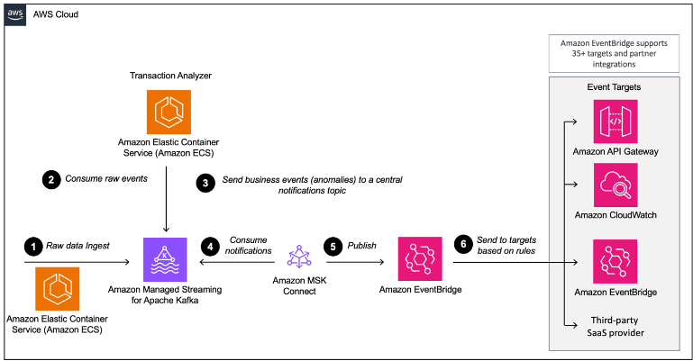

# Build event-driven architectures with Amazon MSK and Amazon EventBridge

[Article](https://aws.amazon.com/blogs/big-data/build-event-driven-architectures-with-amazon-msk-and-amazon-eventbridge/)

- Events - Immutable facts about sometihing that happened in the past.
- Event-driven architecture (EDA) 
    - A pattern that uses events to trigger and communicate between decoupled services.
    - Provide insight into customer behaviour
- Modern Event Brokers
    - Amazon MSK(Kafka)
    - Amazon EventBridge
- EventBridge 
    - serverless event bus that ingests data
    - Provide a consistent and secure integartion for different downstream consumers
- Event Bridge Pipes
    - A fully managed point-to-point integration, and the open-source EeventBridge sink connector for Kafka Connext
- 2 Ways to send events from Kafka to EventBridge
    - Amazon Event Bridge Pipes (preferred)
    - EventBridge sink connector for Kafka Connect

## EventBridge sink connector vs. EventBridge Pipes
- EventBridge Pipes
  - Connects sources to targets with a point-to-point integration
  - Supporting event filtering, transformations, enrichment and delivery to multiple AWS services
  - External HTTPS based targets using API Destinations
  - Prefered by AWS and easiest way to integrate Kafka with EventBridge
- When to choose EventBridge sink connector
  - Already invested in processes and tooling around the Kafka Connect framework
  - Integrating with a Kafka-compatible schema registry e.g., the AWS Glue Schema Registry,
  - Sending events from on-premises Kafka environments directly to EventBridge Event Buses

## Solution

The workflow consists of the following steps:

1. The demo application generates credit card transactions, which are sent to Amazon MSK using the Avro format.
2. An analytics application running on Amazon Elastic Container Service (Amazon ECS) consumes the transactions and analyzes them if there is an anomaly.
3. If an anomaly is detected, the application emits a fraud detection event back to the MSK notification topic.
4. The EventBridge connector consumes the fraud detection events from Amazon MSK in Avro format.
5. The connector converts the events to JSON and sends them to EventBridge.
6. In EventBridge, we use JSON filtering rules to filter our events and send them to other services or another Event Bus. In this example, fraud detection events are sent to 6. Amazon CloudWatch Logs for auditing and introspection, and to a third-party SaaS provider to showcase how easy it is to integrate with third-party APIs, such as Salesforce.

For detailed steps, see the [article](https://aws.amazon.com/blogs/big-data/build-event-driven-architectures-with-amazon-msk-and-amazon-eventbridge/).

[//]: # (Todo work through the stepas in article and create a demo)