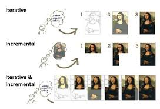

# Incrementalism

Taking adavcntage of modularity and compentization.

- Building value progressively

## Importance of Modularity

- My Experience good example
  - A system that gets the data for a statement
  - A system that takes the data and forms a PDF
  - A system that sends the PDF to the customer via mail
  - A system that tracks the outcome of the mail sending
    - You could easily swap out one of the 4 above i.e a new email client or pdf generation tool or maybe a new data source.
- Divide things into pieces that solve a single part of the problem
- This doesn't have to be done at architectural level also be done at a code level think 'Modular Monoloith'.

## Organizational Incrementalism

- Frees teams to work indepently on a specific part of the organiaztion/problem/system
- Organizations can make small incremenal chnages to areas of the organization
- Challenges
  - How do you spread a solution across the organization?
  - How do you explain and motivate adoption?
  - Organizational and procedural barriers
- Leave room in process and plicies to allow for creative freedom and experimentation
- Modular organizations are more flexible and adaptable and scalable

Defining characteristic of high performing teams is the ability to make decisions quickly and effectively wihout people from outside their group.

Small teams are important
- Make decisions quickly
- Adaptable
- Progress in small **Incremental** steps

## Tools for Incrementalism

- Feedback
- Experimentation
- Modularity
- Separation of Concerns
- Refactoring
- Version Control
- Testing

## Limiting the Impaxt of Change

- Managing Complexity
- Example 'Ports and Adapters'
  - At an interface point we want to decouple two components a 'port' define a piece of code to transalte inpiuts and ouputs the 'adapter'.
  - Allows incremental progression in either the port of the adpater without impacting the other.
- Take care at integration points
- Speed of feedback - how quick do i know i have broken something
- CI/CD aims to provide quick and continous feedback

## Incremental Design
- Agile - we can begin work before we know the answers
- Learn as we progress
- Key is having the minimum amount of design so that we can start work
- Not knowing is fine if not expected as we cannot know everythign upfront
- Do not over engineer start simple and evolve - KISS